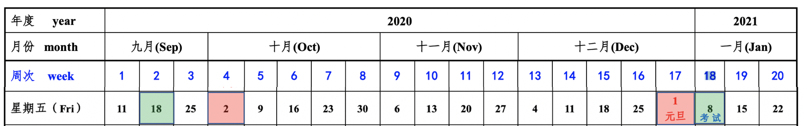

# Experimental Method in Nuclear Physics

### 课程信息
- [教学大纲](Syllabus.md)
#### UCAS
- **学时**：48/3.0
- **地点**： 教2-118 
- **时间**： < 星期五 第1-第3节 8:30-11:20 > 2-18周
- **助教**：吴鸿毅

- **补课**: 10月30(周六上午)，11月6日(周六下午)，11月21日（周六下午), 11月28日(周六下午)

#### PKU
- **学时**：64/4.0
- **地点**： 二教-413
- **时间**： < 星期三、五 第7-第8节 15:10-17:00 > 1-16周
- **助教**：宋昀轩

### 参考书 
 - [Techniques for Nuclear and Particle Physics Experiments](https://link.springer.com/book/10.1007%2F978-3-642-57920-2) Springer, 可下载
 - Radiation detection and measurement 4th edition
 - 原子核物理实验方法 第三版
 
### 高阶数据处理课程
 - [核物理实验数据处理与分析](https://zhihuanli.github.io/Experimental-Data-Analysis-Course/)
 
### Jupyter 网站
 - 网站支持基于jupyter的ROOT C++和python语言编程，供作业代码调试用。
 - [UCAS](https://cn-zz-bgp.sakurafrp.com:35822)
 - [PKU](https://162.105.54.124:8888)

 * 先阅读主页面内Readme.ipynb文件 以及 jupyter.ipynb文件
 

### 作业

- 可在Jupyter页面内调试。
- 作业所需ROOT功能的帮助文档参见 jupyter网站内ROOT Tutorial内相关文档

- **chapt1**
   * [作业1.1 计算bragg曲线](https://zhihuanli.github.io/Experimental-Method-in-Nuclear-Physics/chapt1/coursework1.1/1.1_bragg_curve.html)
      * [能量损失计算方法](https://zhihuanli.github.io/Experimental-Method-in-Nuclear-Physics/chapt1/energy%20loss/eloss_calculation.html)
   * [作业1.2 望远镜法](https://zhihuanli.github.io/Experimental-Method-in-Nuclear-Physics/chapt1/coursework1.2/1.2_telescope.html)
      * [望远镜法-粒子鉴别](https://zhihuanli.github.io/Experimental-Method-in-Nuclear-Physics/chapt1/telescope/telescope.html)
- **chapt2**
   * 作业2.1 
     * 参考[中心极限定理](https://zhihuanli.github.io/Experimental-Method-in-Nuclear-Physics/chapt2/2.centerlimit.html)的做法，用指数分布和朗道分布验证中心极限定理。
   * 作业2.2
     * 求飞行时间法测中子能量方法的相对误差公式 R(E)=δE/E, 装置以及符号参考第二章课件。 
 - **chapt3**
   * [作业3.1 HpGe gamma探测器刻度](https://zhihuanli.github.io/Experimental-Method-in-Nuclear-Physics/chapt3/coursework3.1/3.1_HpGe_gamma_calibration.html)
     * [gamma探测器刻度方法](https://zhihuanli.github.io/Experimental-Method-in-Nuclear-Physics/chapt3/calibration_method/HpGe_Calibration_method.html)
     * [示例代码](https://zhihuanli.github.io/Experimental-Method-in-Nuclear-Physics//chapt3/code/HpGe_gamma_calibration_code.html)
   * 作业 3.2
     * [作业2.1-第6.加入探测器分辨](https://zhihuanli.github.io/Experimental-Method-in-Nuclear-Physics/chapt1/coursework1.2/1.2_telescope.html)
### 课程论文-PKU
  - 论文内容：探测器，仪器，实验方法等
      * 一篇实验论文或研究工作为主，讲解文章中的实验装置以及数据分析方法
        * 格式：3页以上，pdf格式。包含文字，图表，参考文献
        * [Phys.Rev.C latex 模板](https://zhihuanli.github.io/Experimental-Method-in-Nuclear-Physics/prc.tex)
 - 时间 
    * 确定论文题目：11月27日(晚10：00前)
    * 论文提交：12月16日(晚10：00前)
    * 提交报告时间：12月21日 晚8：00前，根据反馈意见修改。
    * 以上内容均提交到助教邮箱(hanjx)。
 - 报告
    * 报告时间：12月23日(周三)，12月25(周五) 上课时间
    * ppt 10页以内，报告7分钟，提问3分钟
   
## Lecture Notes

### [Chapter 0. Introduction](https://disk.pku.edu.cn:443/link/B810999F9FAD1D8ED89A4378FA45C65B) 
 - 访问密码：hs6I

### [Chapter 1. Interaction of Radiation with Matter](https://disk.pku.edu.cn:443/link/61D229EF3028094EAA5AAD67A3DC6A48)
 - 访问密码：Gbxv
 * Reference
   * Telescope
     * [LASSA](https://zhihuanli.github.io/Experimental-Method-in-Nuclear-Physics/chapt1/ref/LASSA_telescope.pdf)
     * [HIRA](https://zhihuanli.github.io/Experimental-Method-in-Nuclear-Physics/chapt1/ref/HIRA_telescope.pdf)
   * Gamma Detector
     * [DALI](https://zhihuanli.github.io/Experimental-Method-in-Nuclear-Physics/chapt1/ref/DALI_array.pdf)
   * Multi-Neutron
     * [Detection of neutron clusters](https://zhihuanli.github.io/Experimental-Method-in-Nuclear-Physics/chapt1/ref/PhysRevC.65.044006_Detection_of_neutron_clusters.pdf)
     * [On the possible detection of 4n events in the breakup of 14Be](https://zhihuanli.github.io/Experimental-Method-in-Nuclear-Physics/chapt1/ref/On_the_possible_detection_of_4n_events_in_the_breakup_of_14Be.pdf)
     * [4n RIKEN](https://zhihuanli.github.io/Experimental-Method-in-Nuclear-Physics/chapt1/ref/PhysRevLett.116.052501.pdf)
    
### [Chapter 2. Statistics and the Treatment of Experimental Data](https://disk.pku.edu.cn:443/link/5F450612A7DBB29B72E85401F539AEDB)
- 访问密码：55nP
 * Reference
     * Poisson Distribution
       * [Superheanvy elements Z=113](https://zhihuanli.github.io/Experimental-Method-in-Nuclear-Physics/chapt2/ref/JPSJ103201.pdf)
     * Null experiments
       * [Location of the Neutron Dripline at Fluorine and Neon](https://zhihuanli.github.io/Experimental-Method-in-Nuclear-Physics/chapt2/ref/PhysRevLett.123.212501.pdf)
     * [中心极限定理](https://zhihuanli.github.io/Experimental-Method-in-Nuclear-Physics/chapt2/2.centerlimit.html)
     * [相邻事件时间间隔分布](https://zhihuanli.github.io/Experimental-Method-in-Nuclear-Physics/chapt2/2.distribution_of_time_intervals.html)
     * Maximum likelihood method
       * [Superallowed Gamow-Teller decay of 100Sn](https://zhihuanli.github.io/Experimental-Method-in-Nuclear-Physics/chapt2/ref/Nature_11116.pdf)
     * Systematic error
       * [16C_neutron halo](https://zhihuanli.github.io/Experimental-Method-in-Nuclear-Physics/chapt2/ref/NPA709.103.16C_halo.pdf) 
### [Chapter 3. General Characteristics of Detectors](https://disk.pku.edu.cn:443/link/C3A886EB2E7717B0A912F082D8016C38)
 - 访问密码：9ao0
 * Reference
     * [时间常数与输出信号形状](https://nbviewer.jupyter.org/github/pkuNucexp/experimental-methods/blob/master/chapt3/time%20constant%20RC.ipynb)
### [Chapter 4. Ionization Detectors](https://disk.pku.edu.cn:443/link/8B009DF917A77848B0E8ABDE6A1DA094)
 - 访问密码：G5ST

### [Chapter 5. Scintillaton Detectors](https://disk.pku.edu.cn:443/link/24C08D24A91360568E5072FF1EE2C738)
- 访问密码：U5dd

### [Chapter 6. Semiconductor Detectors](https://disk.pku.edu.cn:443/link/4FB9D1810CB5A3EEA280A99A9FE92F1D)
- 访问密码：ITM6

### [Chapter 7. Electronics for Pulse Processing](https://disk.pku.edu.cn:443/link/65861FD6D8EB9B35269DC5C1CA696A5F)
- 访问密码：S2CQ

### [Chapter 8. Data Acquisition Systems](https://disk.pku.edu.cn:443/link/553EED05B5C8EB33840CBB44B58855AC)
- 访问密码：1zMZ

### [Chapter 9. Digital Pulse Processing in Nuclear Physics](https://disk.pku.edu.cn:443/link/613AE2807932ECCCAFAC2FF45BE56624)
- 访问密码：Y47S
