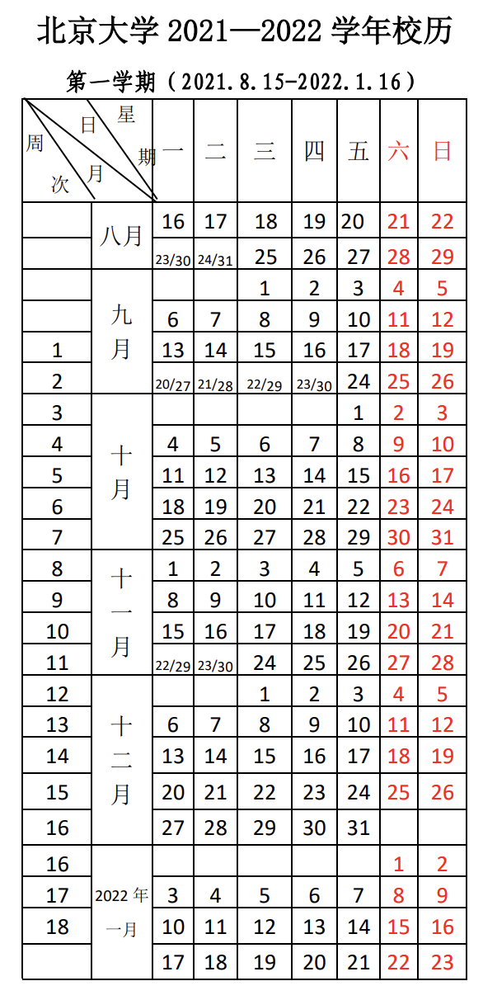
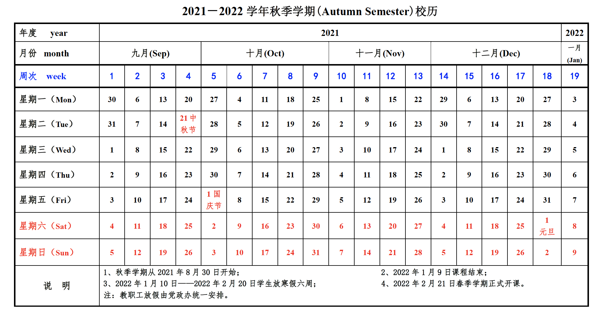

# 《核物理与粒子物理实验方法》课程 教学大纲 

### 学时：
- PKU：68
- UCAS：48

#### PKU
- **地点**： 三教-506
- **时间**： < 星期三、五 第7-第8节 15:10-17:00 > 1-16周
- **助教**：郭成宇
- 
#### UCAS

- **地点**： 教2-118 
- **时间**： < 星期五 第1-第3节 8:30-11:20 > 2-18周
- **助教**：吴鸿毅

### 第一章 射线与物质的相互作用（12/8学时） 

1. 重带电粒子与物质的相互作用 

2. 电子与物质的相互作用 

3. Gamma与物质的相互作用 

4. 中子与物质的相互作用 

- 要求：掌握各种辐射与物质的相互作用，Beth-Bloch公式，布拉格峰，望远镜法
- 参考文献：
 1. Nucl.Instr.Meth.A 473 (2001) 302
 2. Nucl.Instr.Meth.A 583 (2007) 302
 3. Nucl.Instr.Meth.A 763 (2014) 596
 4. Phys.Rev.C 65 (2002) 044006
 5. Phys.Rev.Lett 116 (2016) 052501 

### 第二章 放射性测量中的统计学（6/6学时）
1. 二项式分布、泊松分布和高斯分布 

2. 中心极值定理 

3. 误差传递公式 

4. 最大似然法和最小二乘法

5. 事件的时间间隔分布 

- 要求：熟练运用误差传递公式，最大似然法，最小二乘法
- 参考文献：
 1. Journal of the Physical Society of Japan 81 (2012) 103201
 2. Phys.Rev.Lett 123 (2019) 212501 
 3. Nucl.Phys.A 709 (2002) 103

### 第三章 探测器信号的一般特征（4/2学时） 

1. 核探测器等效电路以及脉冲信号的主要特征 

2. 能量分辨率、时间分辨率 

3. 探测效率、探测器死时间 

- 要求：探测器等效电路，脉冲信号特征，感应信号，能量分辨率，时间分辨率

### 第四章 气体探测器 （6/6学时） 

1. 气体电离和传输过程 

2. 雪崩放大机制与气体探测器工作区 

3. 电离室、正比室 

4. MWPC、PPAC、漂移室、TPC 

5. 新型气体探测器 

- 要求：气体探测器的工作区，放大机制，各种类型的气体探测器的工作原理

### 第五章 闪烁探测器（6/6学时） 

1. 闪烁体探测器的一般特性 

2. 无机闪烁体和有机闪烁体， 

3. 脉冲形状甄别 

4. 光电倍增管 

5. 切伦科夫辐射
- 要求：闪烁体探测器工作原理，脉冲形状甄别，切伦科夫辐射

### 第六章 半导体探测器（6/6学时） 

1. PN结与耗尽层 

2. 硅探测器和高纯锗探测器

3. 位置灵敏探测器 

4. 半导体光敏元件 

- 要求：耗尽层，硅探测器，高纯锗探测器，位置灵敏探测器，半导体光敏探测器

### 第七章 核电子学（12/8学时） 

1. 同轴电缆中的脉冲信号传输 

2. 前置放大器、主放大器、ADC 

3. 时间甄别方法、TDC 

4. 符合方法 

- 要求：同轴电缆信号传输，信号的反射，能量电子学，时间电子学，符合

### 第八章 数据获取系统（4/3学时） 

1. 获取系统的基本组成 

2. CAMAC系统和VME系统 

3. 核物理实验的电子学与获取系统应用 

- 要求：获取系统，核电子学与获取系统应用

### 第九章 探测器信号的数字化处理（4/3学时） 

1. 数字信号处理 

2. Nyquist 采样定理 

3. FPGA和数字滤波器 

4. 数字化电子学 

- 要求：数字信号处理，数字化电子学

### 课程论文报告 （4/0学时）
- 论文：探测器，仪器，实验方法等，以一篇实验论文或研究工作为主，讲解文章中的实验装置以及数据分析方法
- 口头报告

### 教学方式：课堂讲授
### 考试方式：闭卷/开卷
### 评分：
- PKU: 期末考试60%+平时作业35%+课程论文5%
- UCAS:期末考试60%+平时作业40%

